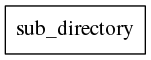
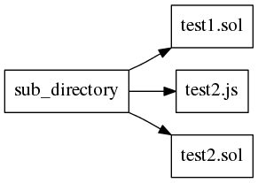
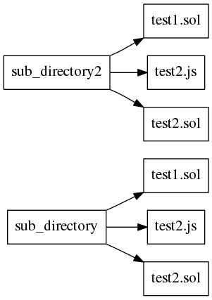

### Issue 
As pointed out in #5175 and #5066, currently, with the "truffle test" command,

the user can only either test the whole /test directory or individual files.

### Solution

In order give the user more possibilities to structure their tests (unit & integration tests),
we should give him the ability to specifiy multiple directories and files, so that the user can create their file structure.

### Specifications
#### Command structure
    truffle test [ fileOrDir... ]

### Unit Tests
- Test for recoginizing the command.
- Test with no arguments and 1 empty directory
  - 
- Test with 1 directory and multiple files in it
  - 
- Test with 2 directories and multiple files in it
  - 
- Test with 3 directories and multiple files in it
  - 
- Test with no cycles and no missing files, where only files are specified.
  - Expected behavior: Executing the specified files and only the specified files without an error message.
- Test with no cycles and no missing directories, where all directories exist and all directories contain one or more file.
  - Expected behavior: Executing the files in the specified directories and only said files without an error message.
- Test with no argument specified and no cycles, where the /test directory includes atleast one file in one of the subdirectories (recursively).
  - Expected behavior: Executing every file inside the /test directory recursively without an error message.
- Test with no argument and cycles through Symlinks inside /test, where the /test directory includes atleast one file in one of the subdirectories (recursively). **DONE**
  - Expected behavior: Executing every file inside the /test directory recursively without an error message and without cycling.
- Test with no argument and cycles through Symlinks inside /test, where the /test directory includes atleast one file outside of the test directory that is linked to the testdirectory through a symlink. **DONE**
  - Expected behavior: Executing every file inside the /test directory plus the file outside of the test directory recursively without an error message and without cycling.
- Test with no argument and empty directory. **Unit test DONE. Integration test PENDING.**
  - Expected behavior: Output error message saying that the command could not find a file inside the /test directory.
- Test with only files specified where one or more file is missing **DONE**
    - Expected behavior: Output error message saying which files are missing.
- Test with only directories specified where one or more directory is missing **DONE**
    - Expected behavior: Output error message saying which directories are missing.
- Test with files and directories specified, where files and directories are missing **DONE**
    - Expected behavior: Output error message saying which directories/files are missing.
- Test with only directories specified where one or more directory is empty **DONE**
    - Expected behavior: Output error message saying which directories are empty.

